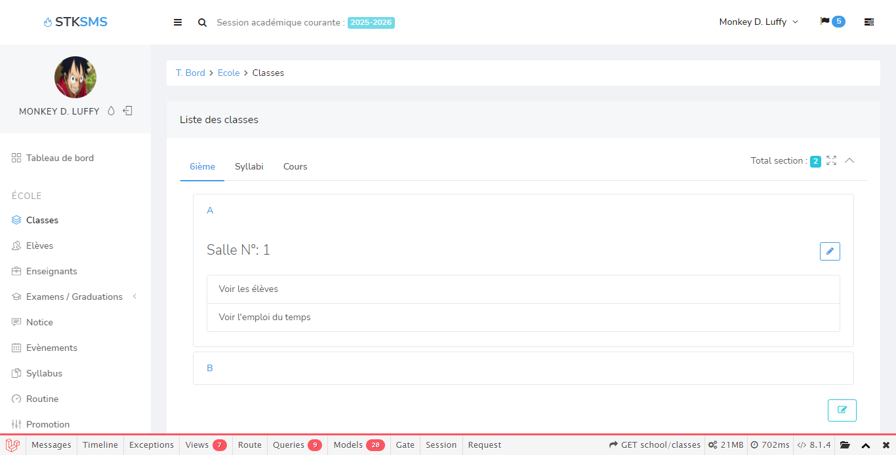
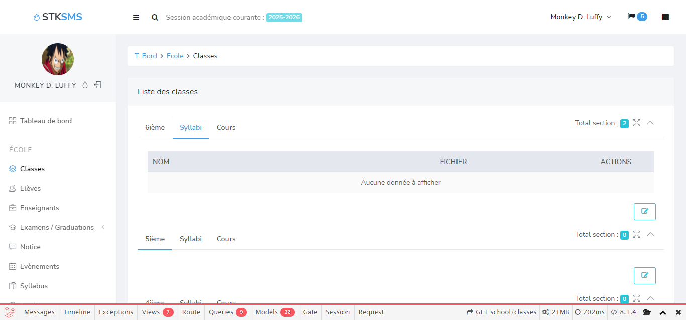
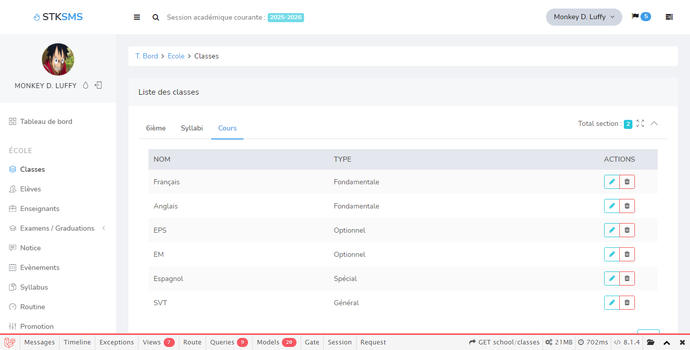
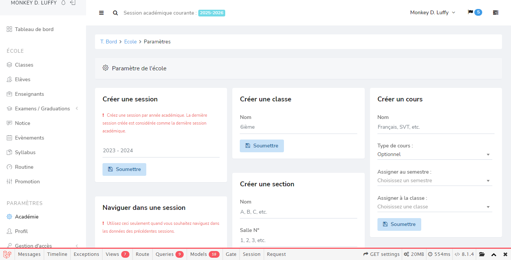

# STK SMS






## About STK SMS

STK SMS is a school management system developed with version 9 of the Laravel framework. Its purpose is to computerize the management that is done manually in some schools, and to facilitate access to various resources that will be made available such as:

- Courses syllabi
- Assignments
- Routines
- Notices
- Exams schedule, and more

STK SMS is accessible, powerful and provides the necessary tools for the complete management of a school.

## How To Install STK SMS

To be able to access the application it is necessary to follow the following steps:

1. Clone the repository with the following command:

```shell
git clone https://github.com/StephaneKuma/sms.git
```

2. Make a copy of the .env.example file and rename it to .env

    - On Mac and linux

        ```shell
        cp .env.example .env
        ```

    - On Windows

    ```shell
    copy .env.example .env
    ```

3. Create a database and fill in the following information in the environment file

```.env
DB_CONNECTION=mysql
DB_HOST=127.0.0.1
DB_PORT=3306
DB_DATABASE=
DB_USERNAME=
DB_PASSWORD=
```

> Please fill in these fields with information from your database

4. Install the various application dependencies

```shell
composer install
```

5. Generate an APP_KEY for the application to be functional

```shell
php artisan key:generate
```

6. Run migrations to prepare database tables

    - Simple migrations

        ```shell
        php artisan migrate
        ```

    - Migrations with test data

        ```shell
        php artisan migrate --seed
        ```

7. Run the app and enjoy

```shell
    php artisan serve
```

## License

STK SMS app is open-sourced software licensed under the [BSD-3-Clause license](https://opensource.org/licenses/BSD-3-Clause).
